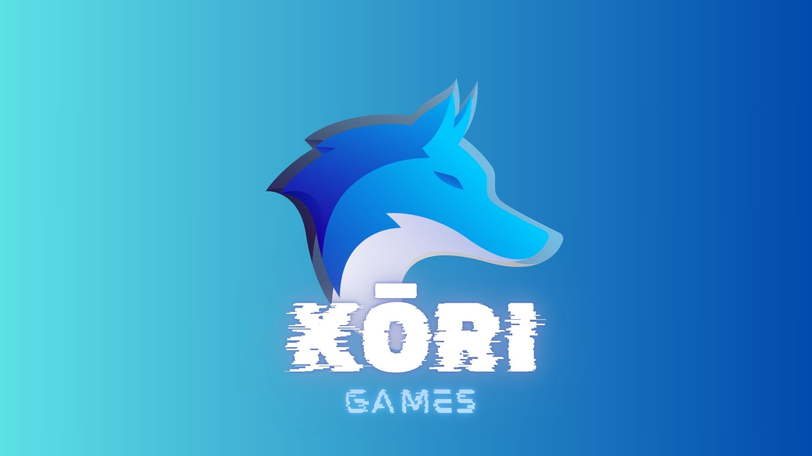
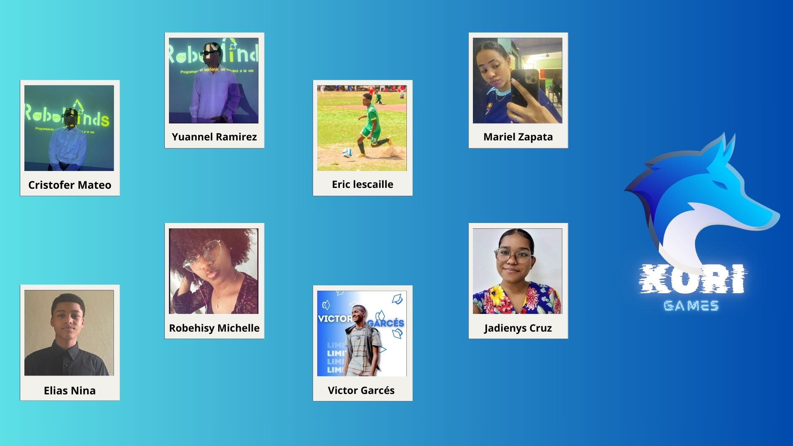
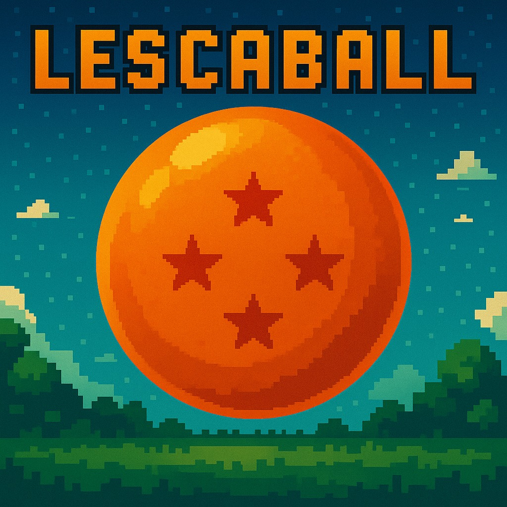
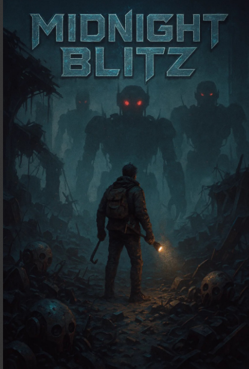

<!DOCTYPE HTML>
<html>
<head>
<title>Kori Games</title>
<link rel="icon" type="image/png" href="images/logo1-removebg-preview.png">
<link href="css/bootstrap.css" rel='stylesheet' type='text/css' />
<link href="css/style.css" rel='stylesheet' type='text/css' />
<meta name="viewport" content="width=device-width, initial-scale=1, maximum-scale=1">
<meta http-equiv="Content-Type" content="text/html; charset=utf-8" />
<link href='http://fonts.googleapis.com/css?family=Open+Sans:400,300,600,700,800' rel='stylesheet' type='text/css'>

<!---->
<!--start slider -->
<link rel="stylesheet" href="css/fwslider.css" media="all">

<!--end slider -->

</head>
<body>
	

		

			

			  

				 

					 

						
					 

					 

						  
						    <ul class="nav" id="nav">					
								

	
							</ul>
							
				    
							
	    		    

	    	    

	            

	    		  <!-- start search-->
				      

							

								<form>
									<input class="sb-search-input" placeholder="Enter your search term..." type="search" name="search" id="search">
									<input class="sb-search-submit" type="submit" value="">
									 
								</form>
							

						

						<!----search-scripts---->
						
						
						
						<!----//search-scripts---->
				    <ul class="icon1 sub-icon1 profile_img">
					 <li>
						<ul class="sub-icon1 list">
						  

						  	
						  		
						  

						   

						  <li class="list_img"></li>
						  <li class="list_desc"><h4><a href="#">velit esse molestie</a></h4>1 x
                          $12.00</li>
						  

							 
<a href="checkout.html">Check out</a>

							 
<a href="login.html">Login</a>

							 

						  

						  

						</ul>
					 </li>
				   </ul>
		           

	       

	      

		 

	    

	

	

	<!-- start slider -->
       

         

            
 
                <!-- Slide image -->
               
                <!-- /Slide image -->
                <!-- Texts container -->
                

                    

                        <!-- Text title -->	
                        <!-- /Text title -->
                    

                

               <!-- /Texts container -->
            

            <!-- /Duplicate to create more slides -->
            

               
                

                    

                    

                

            

            <!--/slide -->
        

        

        

        

       

	<!--/slider -->
      

	  

		
	

	<!--/Juegos  -->
	

		

			<h3 class="m_3">Nuestros juegos</h3>
			

			  

				

				  
<a href="single.html">
                    
                    
 

                    
 

                      

                        <h2>LESCABALL</h2>
                        
¡Goku y Vegeta se enfrentan como nunca antes en este combate retro 2D!
							 
							¡La batalla comienza ya!
						

                      

                   </a> 

                  <h4 class="m_4"><a href="#">LESCABALL</a></h4>
                  
Peleas al estilo antiguo, poderes clásicos y pura adrenalina. 
					Elige tu guerrero, domina sus técnicas y demuestra quién es el verdadero saiyajin legendario.

                

                

					
<a href="single.html">
                    
                    
 

                    
 

                      

                        <h2>LA MINA DEL TESORO</h2>
                        
Adéntrate en una mina oscura llena de secretos y peligros.

                      

                    </a> 

                   <h4 class="m_4"><a href="#">LA MINA DEL TESORO</a></h4>
                   
Tu misión: encontrar el cofre escondido y hacerte rico... 
					¡antes de que la cueva se derrumbe! Cada rincón puede tener una pista, un tesoro o una trampa.
					 ¿Lograrás escapar con el oro a tiempo?

				

				<!--/estilos -->
				

					
<a href="single.html">
                    
                    
 

                    
 

                      

                        <h2>MIDNIGHTBLITZ</h2>
                        
TEl mundo ha caído bajo el control de los robots, y tú eres el último humano sobreviviente.

                      

                    </a> 

                   <h4 class="m_4"><a href="#">MIDNIGHTBLITZ</h4>
                   
 El mundo ha caído bajo el control de los robots, y tú eres el último humano sobreviviente.
					 Armado solo con ingenio y pocos recursos, debes explorar las ruinas en busca de tecnología que te ayude a enfrentarlos,
					 mientras evitas ser cazado por las máquinas que patrullan sin descanso.

				

				

					
<a href="single.html">
                    
                    
 

                    
 

                      

                        <h2>PLANTA VS ZOMBIE</h2>
                        
¿Te suena el clásico Plants vs. Zombies? Pues aquí está mi versión, con un toque único. 

                      

                     </a> 

                   <h4 class="m_4"><a href="#">PLANTA VS ZOMBIE</a></h4>
                   
Defiende tu jardín de oleadas de zombis usando plantas estratégicas, 
					poderes especiales y nuevas sorpresas. Mantén a los no-muertos a raya mientras desbloqueas niveles cada vez más desafiantes.
					¿Podrás proteger tu casa hasta el final?

				

			

		 

	    

    

        

            

                

                    <h2>Kori Games</h2>
                    
Somos una empresa dedicada a la creación y desarrollo de páginas web y videojuegos, 
						combinando innovación y calidad en cada proyecto. Nos especializamos en ofrecer experiencias digitales únicas, 
						adaptadas a las necesidades de cada cliente, desde sitios web funcionales y modernos hasta videojuegos que abarcan una amplia gama de géneros y estilos.

						 

En el ámbito de los videojuegos, destacamos por nuestra diversidad y excelencia, 
entregando títulos que van desde emocionantes aventuras hasta juegos casuales,
 todos diseñados con un alto estándar de calidad. Nuestro compromiso es crear productos que no solo entretengan, 
 sino que también impacten y perduren en la memoria de los jugadores.

  

Con un enfoque innovador y un tono formal, buscamos posicionarnos como líderes en el sector,
 impulsando experiencias digitales que combinan creatividad, tecnología y diseño impecable..

                

            

        

    

		

			

				

					

						<ul class="footer_box">
							<h4>Juegos</h4>
							<li><a href="#">LESCABALL</a></li>
							<li><a href="#">PURGATORIO</a></li>
							<li><a href="#">MIDNIGHTBLITZ</a></li>
							<li><a href="#">PLANTA VS ZOMBIE</a></li>

						</ul>
					

					

						<ul class="footer_box">
							<h4>contacto</h4>
							<li><a href="#">midnightgames195@gmail.com</a></li>
							<li><a href="#">midnight_games_</a></li>
						</ul>
					

					

						<ul class="footer_box">
							<h4>ubicacion </h4>
							<li><a href="#">C/Cristo Rey, Esq. 6 de Noviembre, Lava Pies, San Cristóbal.</a></li>
						</ul>
					

					

						<ul class="">
					        

							<ul class="social">	
							  <li class="facebook"><a href="https://www.facebook.com/profile.php?id=61559291321818"> </a></li>
							  <li class="twitter"><a href="#"> </a></li>
							  <li class="instagram"><a href="https://www.instagram.com/midnight_games__/"> </a></li>											  				
						    </ul>
						</ul>
						
					

				

				<marquee>
© 2025 by kōri Games
 </marquee>`
				

					 
   				

			

		

</body>	
</html>
